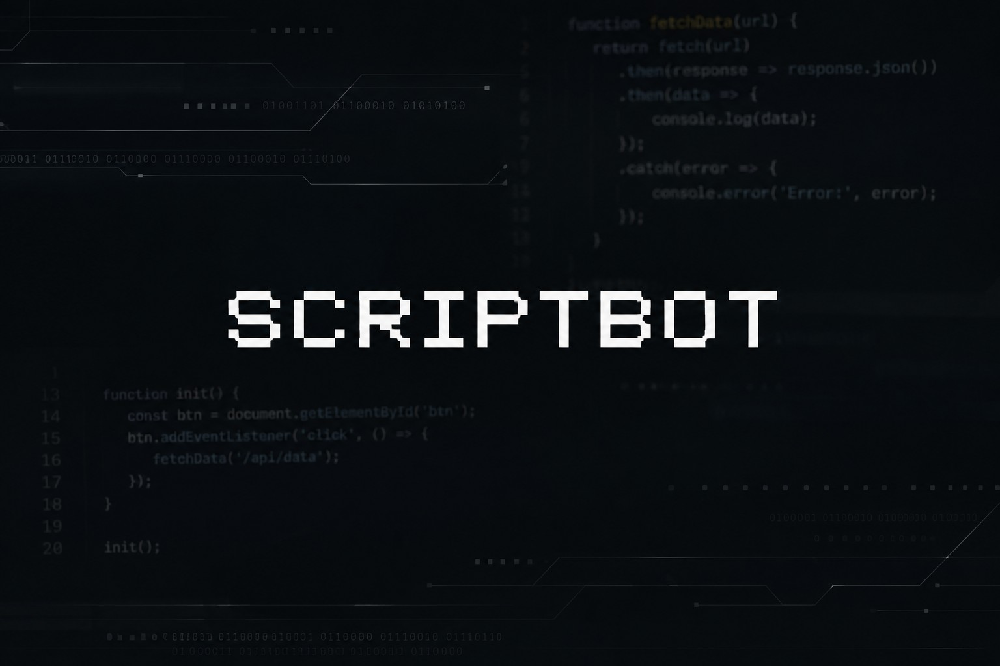

<p align="center">
  
</p>

<h1 align="center">ScriptBot</h1>
<p align="center"><b>by primenimoo</b></p>

ScriptBot — это Telegram-бот для публикации, хранения и удобного поиска файлов, схем, заставок и других материалов для DIY/IoT устройств.

Проект сделан как единый GitHub-репозиторий: внутри находится сам бот, Docker-конфигурация, установочный скрипт, обновление, бэкапы и документация.

## Для чего нужен ScriptBot

Бот помогает создать каталог материалов под разные устройства. Администратор может добавлять устройства, категории, файлы, схемы и заставки. Пользователи могут отправлять свои материалы на проверку, а администратор одобряет их через панель.

Примеры устройств:

- M5StickC PLUS2
- Flipper Zero
- ESP32
- Arduino
- LilyGO T-Embed
- любые другие устройства, которые добавит администратор

## Возможности

- Inline-кнопки и аккуратная навигация.
- Каталог файлов.
- Каталог схем.
- Каталог заставок.
- Конвертер фото/GIF/видео в формат Bruce/M5Stick `240×135`.
- Пользовательские заявки на добавление материалов.
- Админ-панель `/admin`.
- Система поддержки через группу и темы.
- Telegram Stars донаты.
- Docker и Docker Compose.
- Установочный скрипт с меню.
- Обновление из GitHub.
- Бэкап и восстановление.
- Обложка по умолчанию `assets/default.png`.

## Системные требования

Минимально:

- Ubuntu 22.04 / Ubuntu 24.04 / Debian 12+
- 1 vCPU
- 1 GB RAM
- 5 GB SSD
- Docker + Docker Compose

Рекомендуется:

- 2 vCPU
- 2 GB RAM
- 10–20 GB SSD

Для конвертера GIF/видео используется FFmpeg внутри Docker-контейнера.

## Установка одной командой

```bash
bash <(curl -fsSL https://raw.githubusercontent.com/atopsstore-dotcom/ScriptBot/main/install.sh)
```

Скрипт покажет меню:

```text
1) Установить ScriptBot на сервер
2) Обновить ScriptBot
3) Создать резервную копию
4) Восстановить из резервной копии
5) Проверить состояние
6) Перезапустить
7) Остановить
8) Удалить
0) Выход
```

При установке скрипт попросит:

- `BotFather token`
- Telegram ID владельца
- дополнительных администраторов
- ID группы поддержки

## Ручной запуск

```bash
git clone https://github.com/atopsstore-dotcom/ScriptBot.git /opt/scriptbot
cd /opt/scriptbot
cp .env.example .env
nano .env
docker compose up -d --build
```

Логи:

```bash
docker compose logs -f
```

Перезапуск:

```bash
docker compose restart
```

## Настройка .env

Главные параметры:

```env
BOT_TOKEN=
OWNER_ID=
ADMINS=
BOT_NAME=ScriptBot
SUPPORT_GROUP_ID=
DEFAULT_COVER_PATH=assets/default.png
```

`OWNER_ID` — Telegram ID владельца. Он получает доступ к админ-панели.

`SUPPORT_GROUP_ID` — ID группы, куда будут приходить тикеты поддержки.

## Поддержка и тикеты

Пользователь нажимает `🆘 Поддержка`, отправляет сообщение, и бот создаёт тикет. Если указана группа поддержки, бот отправляет туда сообщение. В группе можно забрать тикет кнопкой `✅ Помочь`. После этого тикет закрепляется за конкретным сотрудником.

## Конвертер заставок

Поддерживается:

- фото → PNG `240×135`
- GIF → `boot.gif` `240×135`
- видео → `boot.gif` `240×135`

Параметры меняются в `.env`:

```env
SPLASH_WIDTH=240
SPLASH_HEIGHT=135
SPLASH_GIF_MAX_SECONDS=5
SPLASH_GIF_FPS=12
```

## Обложка

Файл по умолчанию:

```text
assets/default.png
```

Чтобы поменять обложку вручную, замените этот файл и перезапустите контейнер:

```bash
docker compose restart
```

## Обновление

Через скрипт:

```bash
bash install.sh
```

Выберите пункт `2) Обновить ScriptBot`.

Или вручную:

```bash
cd /opt/scriptbot
git pull
docker compose up -d --build
```

## Бэкап

Через скрипт выберите пункт `3) Создать резервную копию`.

Также в боте владелец может выполнить:

```text
/backup
```

Бот отправит файл `.sbak` с настройками, базой и обложкой.

## Восстановление

Через скрипт выберите пункт `4) Восстановить из резервной копии`.

## Команды бота

- `/start` — главное меню
- `/admin` — админ-панель
- `/backup` — создать бэкап
- `/paysupport` — поддержка платежей
- `/connect_support_group` — показать ID группы поддержки

## Один репозиторий или несколько?

Лучше один репозиторий. В одном репозитории хранятся:

- код бота;
- Dockerfile;
- docker-compose.yml;
- install.sh;
- update.sh;
- README.md;
- assets;
- документация.

Так пользователю проще установить, обновлять и понимать проект.

## Статус

Это рабочая основа ScriptBot. Проект можно развивать дальше: расширять админ-панель, добавлять полноценный редактор категорий, расширять импорт ZIP и делать новые модули.
